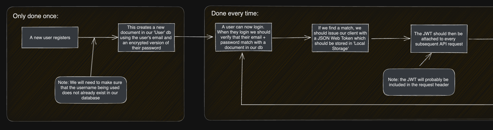

# Football Friends - Project 3

## Code Kickers FC

## Overview

- Application to connect people based on their favourite Football teams and players
- Users can create a profile with their key information and their football team/player likes.
- Users can view other users to identify other similarities in likes.
- Users can customise their favoured players and explain why they like them.
- Version 1 of this App will be simple but there are plenty of additional features we aim to build in the future.

## Entity Relationship Diagram

In the above ERD we have listed all the attributes of both the Users and Admired Players Schemas and the relationship between them.
## Data Flow and Component Hierarchy
### Link to Excalidraw Diagram/Flow Chart:
https://excalidraw.com/#json=JyhH0fF_IU_l3CyIbrwWX,1EPJqHp2bf5Ks3uXcO1o1w

- Here we’ve listed all of the top level components that we’ll be making use of throughout the project.
- Starting from the top of the hierarchy tree, we’ve visually displayed all of the components and how they will flow in to one another.
- Under each component, we’ve listed a three step process (signified by the three separate colors) where the flow of data is described.

## Models

- We’ve included the 2 core Models we’ll be making use of throughout the project.
- We decided that as the Player Schema is closely linked to the User Schema, that the two should be linked via an embedded relationship.
- Favourite Team is a key which may undergo some functional development as the project progresses, but for now it’ll remain a standard key:value pair with a String data type.

## Team Expectations

### Link to Google Docs Team Expectation sheet:

https://docs.google.com/document/d/1TWpg1u1rXhTKCyDuWgDQZmLaGjY8xo24nyqrrdJnQvM/edit?usp=sharing

- Within this document we’ve outlined the best practices which we agreed upon as a team.
- This includes timeline, best communication practices etc

## User Stories

<ul>
    <li>As a User, I want to join the Football Friends community by registering on the platform.</li>
    <li>As a User, I want to secure my data by being able to log in and out of my account.</li>
    <li>As a User, I want to connect with fellow fans of my favorite team by selecting them on my profile.</li>
    <li>As a User, I want to discover and connect with other fans who share my admiration for certain players by adding them to my profile.</li>
     <li>As a User, I want to personalize my profile to make it easy for other users to identify me.</li>
     <li>As a User, I want to update my user profile whenever there are changes to my information.</li>
     <li>As a User, I want to keep my profile up to date by editing the reasons why I admire certain players.</li>
     <li>As a User, I want the flexibility to remove players from my admired list if I change my mind.</li>
     <li>As a User, I want to explore and discover like-minded fans by viewing other people’s profiles.</li>
     <li>As a User, I want to stay current by being able to add new players that I admire to my profile.</li>
     <li>(ADDITIONAL) As a User, I want to add a profile photo so that other users can put a face to my name.</li>
     <li>(ADDITIONAL) As a User, I want to rate the performance of my admired players in recent matches so that I can compare my assessments with other users.</li>
     <li>(ADDITIONAL) As a User, I want to watch a tutorial video that explains how to use the app so that I can quickly become proficient.</li>
     <li>(ADDITIONAL) As a User, I want to initiate connections by sending ‘likes’ to other fans who share my interests.</li>
     <li>(ADDITIONAL) As a User, I want to receive notifications of likes that have been sent to me so that I can connect with fans who are interested in connecting with me.</li>
     </ul>

### Tracking User Story Progress

- Throughout the project, we made use of an online tool called Miro to track progress.
- We were able to track the User Stories using a simple color coded table like below.
  

## Wire Frames

#### Browser Wire-Frame

#### Browser Wire-Frame Whole App

#### Mobile Wire-Frame

#### Mobile Wire-Frame / Whole App

## Project Management

### Link to Project Management system:

https://github.com/users/jayteebee/projects/1

- For Project Management systems, we’ve made use of GitHub Projects.

## Timeframe And Working Team

We were given this project on the 4th May, 2023 and were tasked to submit and deploy by Friday 12th.
Team members:

- Tom Court
- Karl Matthews
- Jack Coots
- Jethro Block

## Back End Technologies Used

- Express
- Mongoose
- MongoDB
- Axios
- Bcrypt
- Cors
- JsonWebToken
- Multer
- Passport
- Passport-jwt

## Brief

### Planning

- Have a thoroughly documented Team Expectations Google document / markdown file.
- Have a thoroughly developed, beautiful README.md file.
- Take time for each team member to discuss where they feel strongest and weakest, in terms of coding ability.
- Create a Excalidraw or Whimsical document to convey the data flow with component hierarchy included.

### Collaboration

- Contribute equally.
- Have a solid understanding of the entire project. (Even the features implemented by other team members.)
- Take time to pair program with teammates to reinforce learning.
- Be prepared to explain sections of code that were written by teammates.

### Client (Front End)

- Have a working, interactive React app, built using npx create-react-app client
- Have at least 6 separate, rendered components in an organized and understandable React file structure.
- Use only React for DOM Manipulation.
- Consume data from your API, and render that data in your components.
- Utilize React Router, for client-side routing.
- Authentication!

### Server (Back End)

- Have working generic router actions for CRUD using Express, Mongoose, and MongoDB.
- Have at least 2 models (more if it makes sense)
- Have full CRUD on at least one of your models
- Be able to Add/Delete on any remaining models (if it makes sense)
- Authentication!

### Styling

- Be styled with CSS.
- Use flexbox (display: flex) or CSS Grid.
- Implement responsive design on 2 screen sizes (including desktop) using a media query (mobile).
- You can use a CSS framework if you want to.
- Linting
- Indent properly.
- Utilize high-quality, semantic variable names and follow naming conventions.
- Remove unnecessary boilerplate React files and code.
- Remove all console.log()s and commented out code (functional notes/comments are okay).

### Deployment

- Deploy the fully functional front-end via GitHub Pages or Vercel.
- Deploy the back-end via Heroku (or vercel).
- Deploy the MongoDB database on MongoDB Atlas.
- More details on how to deploy will be shared later separately.

### Procedural

- Have frequent commits from every team member dating back to the very beginning of the project. These commits should total to or exceed 50.
- Commit often and use meaningful commit messages
- Use effective and safe branching and merging processes.
- Every team member must have commits contributing to the project.
- Pair programming is allowed and should be noted in the commit by using @github_username of each developer pairing
- No single developer should do a majority of the commits
- Document your code well.

### Stretch Goals

- Build a UML Use-case diagram
- Use JSDoc to document your project
- Use a 3rd party API
- High quality, professional design
- useContext
- Allow users to upload files

## Planning

Much of our planning process can be seen at the top of this document.
One key point to add is that once we had started to work on the project, we made good use of Github’s Project planning tool to create and track tickets which needed to be completed. We were then able to claim responsibility of certain tasks and make sure tasks were being complete in the correct fashion.

## Build Process

## Challenges

One of the challenges we faced within the project was how to divvy up responsibilities to ensure that everyone had at least some exposure to areas of coding with which they’re not as comfortable.
Once we had started to merge the front/back end (as detailed below) we decided that it’d be an opportune time to switch roles for a day so we could achieve the goal stated above.
Safe to say it was a bit of a challenge getting up to speed, but certainly a worthwhile process as not much time was lost making progress towards the MVP.

## Wins

One of the big wins that we experienced collectively as a team was the ability to communicate clearly and efficiently throughout the course of the project.
Doing so meant that we encountered very few merge conflicts, and when they did occur they were minor and didn’t take too long to sort out.
This was born out of the discussions we had whilst planning. We all agreed that the best way to approach a group project was to put communication as the main priority.
This looked like frequent screen sharing and group git pushing, code debugging and progress reports.
Approaching the project in this manner not only lead to a less stressful Project week, but also an end product that we could be proud of.
Another big win for the team was when we joined the front and back end.
Doing so was quite a pivotal moment in the project as up until then, the two code bases hadn’t connected and the nature of our approach (a front/back end split in pairs) meant although we knew what each other was doing, we didn’t have hands on experience in each others code base.

### Authentication

As listed above, one of the MVP requirements for this project was implementing authentication for the application. Given this was a new and quite difficult challenge, it is worth calling out how we approached this and how we got on.

When we first started to tackle this feature, it was evident that there wasn't a clear understanding of all the moving parts involved in authentication. It therefore felt sensible to actually sketch out a high level flow of all the steps involved.

See below the diagram we came up with:

It was once we had this fleshed out that we were able to confidently start programming the various requirements. Due to the fact that we had chunked up the process into small parts we managed to progress through the actual implementation quite quickly.

Another benefit of the process flow was communicating the process to the whole team. Not everyone on the team was directly involved in implementing the authentication, but it of course would impact everyone. It was with the high level process flow that we were able to communicate easily what was happening.

### Project Management

As a team, one of our strengths was communicating effectively and making sure we were always making progress. One thing that really helped with that, outside of each team member's individual efforts to communicate effectively, was the use of the github projects tool.

See below a screenshot of a section of the tool from within the project.

As you can see, we split the different tasks up to be represented by different tickets. We included a brief description of what work was involved, who was responsible for it, what stage it was at as well as a few other details.

This really helped to ground our planning conversations each day. It was clear what was still left to do to reach MVP, it was clear who was owning what and it was clear what order the work needed to be done in. It was also easy to keep track of what everyone in the team was working on which helped to avoid merge conflicts when we came to pull requests.

### Git Process

It has been highlighted that we as a team are proud of the way we worked together. One other bit to call out which helped us was the way that we managed our git processes to make sure that our work was consistently being synced up.

The first part of that was making sure that our git process was clear. We sketched out the process, calling out the commands and steps required so that it was really clear.

This combined with the way that we agreed to work together meant that the team were frequently committing their work and we were doing pull requests several times a day.

We had well over 200 commits by the end of the project.

We also worked through around 50 pull request and merges.

In just 4 working days of development time, this helps to demonstrate the way that we as a team worked together. We are especially proud as it for each team member this was the first time working on a group project in the world of software development.

## Future Improvements

In the future, we’d like to build out more functionality within our app to make it closer to something that could be deployed in the real world.
Specifically:

- Messaging functionality so that users who have connected over a mutual player or team could then arrange to go and see a game together.
- Third Party API Integration to include the latest news, scores and matches happening in the various football leagues.
