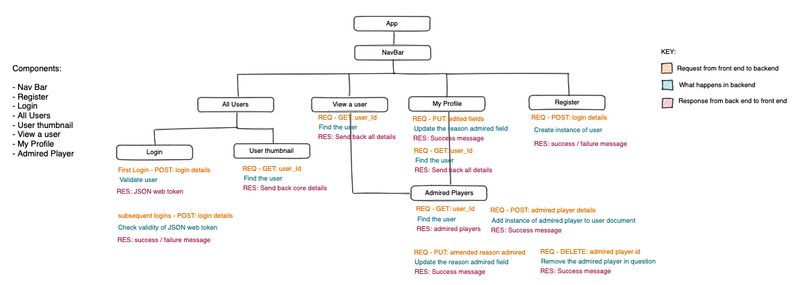
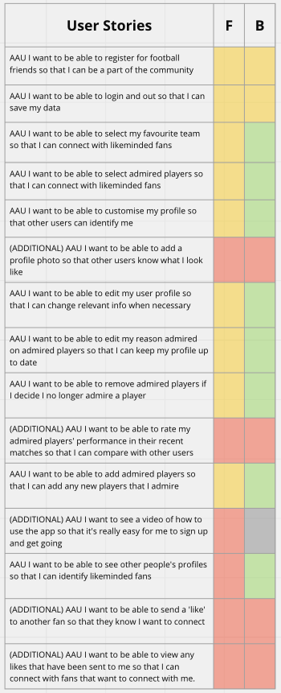
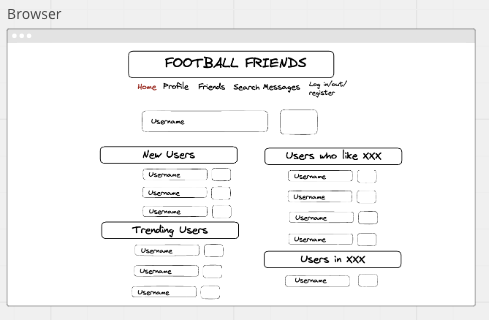
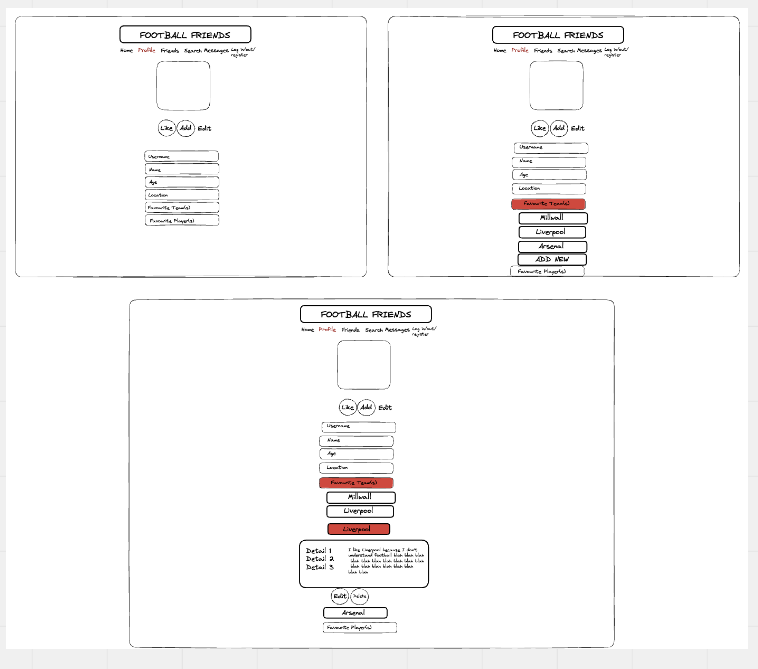
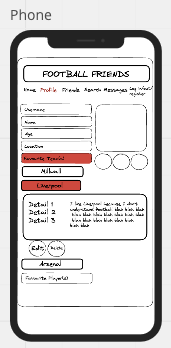
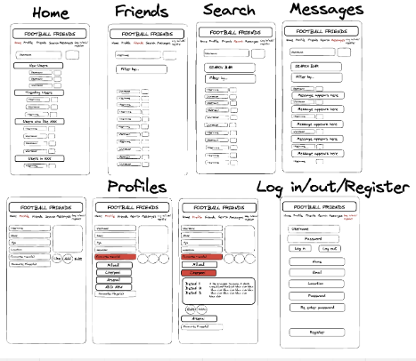

# Football Friends - Project 3

## Code Kickers FC

## Overview

- Application to connect people based on their favourite Football teams and players

- Users can create a profile with their key information and their football team/player likes.

- Users can view other users to identify other similarities in likes.

- Users can customise their favoured players and explain why they like them.

- Version 1 of this App will be simple but there are plenty of additional features we aim to build in the future.

## Entity Relationship Diagram

In the above ERD we have listed all the attributes of both the Users and Admired Players Schemas and the relationship between them.

## Data Flow and Component Hierarchy

### Link to Excalidraw Diagram/Flow Chart:

https://excalidraw.com/#json=JyhH0fF_IU_l3CyIbrwWX,1EPJqHp2bf5Ks3uXcO1o1w

- Here we've listed all of the top level components that we'll be making use of throughout the project.
- Starting from the top of the hierarchy tree, we've visually displayed all of the components and how they will flow in to one another.
- Under each component, we've listed a three step process (signified by the three separate colors) where the flow of data is described.

## Models

- We've included the 2 core Models we'll be making use of throughout the project.
- We decided that as the Player Schema is closely linked to the User Schema, that the two should be linked via an embedded relationship.
- Favourite Team is a key which may undergo some functional development as the project progresses, but for now it'll remain a standard key:value pair with a String data type.

## Team Expectations

### Link to Google Docs Team Expectation sheet:

https://docs.google.com/document/d/1TWpg1u1rXhTKCyDuWgDQZmLaGjY8xo24nyqrrdJnQvM/edit?usp=sharing

- Within this document we've outlined the best practices which we agreed upon as a team.
- This includes timeline, best communication practices etc

## User Stories

<ul> 
    <li>As a User, I want to join the Football Friends community by registering on the platform.</li> 
    <li>As a User, I want to secure my data by being able to log in and out of my account.</li> 
    <li>As a User, I want to connect with fellow fans of my favorite team by selecting them on my profile.</li> 
    <li>As a User, I want to discover and connect with other fans who share my admiration for certain players by adding them to my profile.</li>
     <li>As a User, I want to personalize my profile to make it easy for other users to identify me.</li> 
     <li>As a User, I want to update my user profile whenever there are changes to my information.</li> 
     <li>As a User, I want to keep my profile up to date by editing the reasons why I admire certain players.</li> 
     <li>As a User, I want the flexibility to remove players from my admired list if I change my mind.</li> 
     <li>As a User, I want to explore and discover like-minded fans by viewing other people's profiles.</li> 
     <li>As a User, I want to stay current by being able to add new players that I admire to my profile.</li> 
     <li>(ADDITIONAL) As a User, I want to add a profile photo so that other users can put a face to my name.</li> 
     <li>(ADDITIONAL) As a User, I want to rate the performance of my admired players in recent matches so that I can compare my assessments with other users.</li> 
     <li>(ADDITIONAL) As a User, I want to watch a tutorial video that explains how to use the app so that I can quickly become proficient.</li> 
     <li>(ADDITIONAL) As a User, I want to initiate connections by sending 'likes' to other fans who share my interests.</li> 
     <li>(ADDITIONAL) As a User, I want to receive notifications of likes that have been sent to me so that I can connect with fans who are interested in connecting with me.</li> 
     </ul>

### Tracking User Story Progress

- Throughout the project, we made use of an online tool called Miro to track progress.
- We were able to track the User Stories using a simple color coded table like below.

## Wire Frames

#### Browser Wire-Frame

#### Browser Wire-Frame Whole App

#### Mobile Wire-Frame

#### Mobile Wire-Frame / Whole App

## Project Management

### Link to Project Management system:

https://github.com/users/jayteebee/projects/1

- For Project Management systems, we've made use of GitHub Projects.
